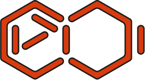

<div align="center">
<h1>
  <br>
  <a href="http://acids.ircam.fr"></a>
  <br>
  Creative Machine Learning
  <br>
</h1>

<h3>Creative Machine Learning course and notebooks in JAX, PyTorch and Numpy.</h3>


<center>
<i>Course given both at the <a href="https://www.u-tokyo.ac.jp/en/index.html" target="_blank">University of Tokyo</a> (Japan) and <a href="https://www.sorbonne-universite.fr/" target="_blank">Sorbonne Université</a> (Paris, France)</i><br/>
<b>Professor</b>: <a href="http://esling.github.io" target="_blank">Philippe Esling</a>
</center>

<h4>
  <a href="#lessons">Lessons</a> •
  <a href="#setup">Setup</a> •
  <a href="#administrative">Administrative</a> •
  <a href="#details">Detailed lessons</a> •
  <a href="#contribution">Contribution</a> •
  <a href="#about">About</a>
</h4>
</div>

This repository contains the courses in machine learning applied to music and other creative mediums.
This course is currently given at the [University of Tokyo](https://www.u-tokyo.ac.jp/en/index.html) (Japan), and along the [ATIAM Masters](http://atiam.ircam.fr) at IRCAM, Sorbonne Paris (France). 
The courses slides along with a set of interactive Jupyter Notebooks will be updated along the year to provide all the ML program.
This course is proudly provided by the <a href="http://github.com/acids-ircam" target="_blank">ACIDS</a> group, part of the [Analysis / Synthesis](http://anasynth.ircam.fr/home/english) team at IRCAM.
This course can be followed entirely online through the set of [Google slides](http://slides.google.com) and [Colab](http://colab.google.com) notebooks links provided openly along each lesson.
However, we do recommend to fork the entire environment and follow the interactive notebooks through Jupyter lab to develop your
own coding environment.

**As the development of this course is always ongoing, please pull this repo regularly to stay updated.**
**Also, please do not hesitate to post issues or PRs if you spot any mistake** (see the [contribution section](#contribution)).

#### Discord channel

Join the [Discord channel](https://discord.gg/meWN48rynW) of this course to join
the community and share experiences and problems.


<details>
  <summary>Table of Contents</summary>
  <ol>
    <li> <a href="#lessons">Lessons</a>
      <ul>
        <li><a href="#lessons">Introduction</a></li>
        <li><a href="#lessons">Machine learning</a></li>
        <li><a href="#lessons">Neural networks</a></li>
        <li><a href="#lessons">Advanced networks</a></li>
        <li><a href="#lessons">Deep learning</a></li>
        <li><a href="#lessons">Bayesian inference</a></li>
        <li><a href="#lessons">Latent models</a></li>
        <li><a href="#lessons">Approximate inference</a></li>
        <li><a href="#lessons">Variational auto-encoders and flows</a></li>
        <li><a href="#lessons">Generative adversarial networks</a></li>
        <li><a href="#lessons">Diffusion models</a></li>
      </ul>
    </li>
    <li> <a href="#administrative">Administrative</a> </li>
    <li> <a href="#details">Detailed lessons</a> </li>
    <li> <a href="#contribution">Contribution</a> </li>
    <li> <a href="#about">About</a> </li>
  </ol>
</details>


## Lessons

**Quick explanation.** For each of the following lessons, you will find a set of badges containing links to different parts of the course, which allows you to follow either the _online_ 
or _offline_ versions.

- Online:
[](https://docs.google.com/presentation/d/e/2PACX-1vRGy4H9JWjxK8d760O4pJT_7wfCett-rKjFV91d6jLkCHSMUntJjRA8a3r25M7_WrIDxggnjeXHdsi2/pub?start=false&loop=false&delayms=1000000&slide=id.p1) 
[](https://colab.research.google.com/drive/1tAIsucXMqHJ0hVTYcuoUzBt69lSn86i0?usp=sharing) 
- Offline: 
[](00_introduction.pdf) 
[](00_setup.ipynb) 

Simply click on the corresponding badge to follow the lesson. Note that if the badge is displayed in red color as follows 
[]() 
it means that the content is not available yet and will be uploaded later. 
Also note that some courses might contain multiple notebooks and extra information, which will be clearly indicated in that case.


---

### [00 - Introduction](00_introduction.pdf)

[](https://docs.google.com/presentation/d/e/2PACX-1vRGy4H9JWjxK8d760O4pJT_7wfCett-rKjFV91d6jLkCHSMUntJjRA8a3r25M7_WrIDxggnjeXHdsi2/pub?start=false&loop=false&delayms=1000000&slide=id.p1) 
[](00_introduction.pdf) 
[](https://colab.research.google.com/drive/1tAIsucXMqHJ0hVTYcuoUzBt69lSn86i0?usp=sharing) 
[](00_setup.ipynb) 

This course provides a brief history of the development of artificial intelligence and introduces the general concepts of machine learning 
through a series of recent applications in the creative fields. This course also presents the pre-requisites, course specificities, toolboxes
and tutorials that will be covered and how to setup the overall environment.


---

### [01 - Machine learning](01_machine_learning.pdf)

[](https://docs.google.com/presentation/d/e/2PACX-1vQiFd_QE7kW1OK2q4tFOtTtXXidXqrNNRDW6-sHp_KhqBa0j2dOvBTgyah-XULhDSSMwZIJvCy0SFQ8/pub?start=false&loop=false&delayms=10000) 
[](01_machine_learning.pdf) 
[](https://colab.research.google.com/drive/1O38voJUpBlvynWJGt8m_gBUMq_LUeMO1?usp=sharing) 
[](01a_machine_learning.ipynb) 
    
This course introduces the formal notions required to understand machine learning along with classic problems of linear models 
for regression and classification. We discuss the mathematical derivation for optimization and various problems of overfitting, cross-validation
and model properties and complexity that are still quintessential in modern machine learning.

**Additional notebook on feature-based learning**

[]() 
[](01b_feature_based_learning.ipynb) 

---

### [02 - Neural networks](02_neural_networks.pdf)

[](https://docs.google.com/presentation/d/e/2PACX-1vRWEyOd3sR1T9Ruc4c3mBq4I3B80l7mS3wwZubWEUINYolJkWlyrNnfqRovw6a7Fbhw1a4xWggTuhZV/pub?start=false&loop=false&delayms=60000) 
[](02_neural_networks.pdf) 
[](https://colab.research.google.com/drive/1PE2WFYL3fRao1JNQV9pnkAk2AbNc3z8y?usp=sharing) 
[](02_neural_networks.ipynb) 

This course provides a brief history of the development of neural networks along with all mathematical and implementation details. 
We discuss geometric perspectives on neurons and gradient descent and how these interpretation naturally extend to the case
of multi-layer perceptrons. Finally, we discuss the complete implementation of backpropagation through micro-grad.


---

### [03 - Advanced neural networks](03_advanced_networks.pdf)

[](https://docs.google.com/presentation/d/e/2PACX-1vTRtjopz1JOL1Tte1TyPL3QADCMdk2Wz39iHw_vWjeCR9fS_qtkoxgoF3jOBoECQVIqn0_RxzV9uBr2/pub?start=false&loop=false&delayms=60000) 
[](03_advanced_networks.pdf) 
[](https://colab.research.google.com/drive/1OK7I0vHDwi-PNX3orxDKO_46v7WeDBBP?usp=sharing) 
[](03_advanced_networks.ipynb) 

In this course we introduce more advanced types of neural networks such as convolutional and recurrent architectures, along
with more advanced models (LSTM, GRU) and recent developments such as residual architectures.
We further discuss issues of regularization and initialization in networks.

---

### [04 - Deep learning](04_deep_learning.pdf)

[](https://docs.google.com/presentation/d/e/2PACX-1vTbg6NR7B92Db4fqcX1JWfW3eDhaR98OqHhv_OmuICo0q_TwbqQE_iD7wAvwl4HxH-IA1Ag3bLbKQWJ/pub?start=false&loop=false&delayms=60000) 
[](04_deep_learning.pdf) 
[](https://colab.research.google.com/drive/1-OGz_vn-4gSa6jm5J6iXv_06X6dgKugq?usp=sharing) 
[](04_deep_learning.ipynb) 

We introduce here the fundamental shift towards deep learning, notably through the development of layerwise training 
and auto-encoders. We discuss how these are now less relevant through novel regularization methods and data availability.
We finish this course by discussing the recent attention mechanism and transformer architectures and
provide a set of modern applications.

---

### [05 - Probabilities and Bayesian inference](05_probabilities_bayesian.pdf)

[](https://docs.google.com/presentation/d/e/2PACX-1vSwbWj5_3IXT6Z1tvA9CtbrEEWc9o7WqeYqLnZQIIa6nIs-2_JbDWwA3pzkYNucDA51s4s6CkSU0XLy/pub?start=false&loop=false&delayms=60000) 
[](05_probabilities_bayesian.pdf) 
[](https://colab.research.google.com/drive/1mYoX0tSFMzRDU1huPYAMBEZQxG9r-VjV?usp=sharing) 
[](05_probabilities_bayesian.ipynb) 

To operate the shift towards generative models, we introduce here the fundamentals of probabilities, distribution and inference.
We discuss several properties and introduce Bayesian inference by developing the mathematical foundations of 
Maximum A Posteriori (MAP) and Maximum Likelihood (ML) techniques.
    
---

### [06 - Latent models](06_latent_expectation_maximization.pdf)

[](https://docs.google.com/presentation/d/e/2PACX-1vSk_urZWEl7xdyQPmc_5ly1Cl5-vARIRwnDrN4XNaULev0HM039ecPk4JLg9HMCIm8xGstQaaqJ1VXh/pub?start=false&loop=false&delayms=60000) 
[](06_latent_models.pdf) 
[](https://colab.research.google.com/drive/17fqMaeY3yrOUHyJI33foz7xFrJrI5w5C?usp=sharing) 
[](06_latent_models.ipynb) 

We discuss the distinction between supervised and unsupervised learning, through the first context of clustering. 
This allows to introduce the notion of latent variables and how we can solve for this using Expectation-Maximization (EM).
We provide the full derivation through Variational inference and discuss the implementation of Gaussian Mixture Models (GMM)

---

### [07 - Approximate inference](07_approximate_inference.pdf)

[](https://docs.google.com/presentation/d/e/2PACX-1vTRPOFFdfMkovNmVbvUCwZ_P99HuJnXfXI0_YBc-0Yo_QK-Xy73M7m7ZKqPl9AaIM8rjxjJ52LFmRbI/pub?start=false&loop=false&delayms=60000) 
[](07_approximate_inference.pdf) 
[](https://colab.research.google.com/drive/1WtD-fbHRxuVotwTv2w1yRDF57iz7aB5P?usp=sharing) 
[](07_approximate_inference.ipynb) 

We introduce here the notion of approximate inference, through historical applications of sampling with Monte-Carlo and Metropolis-Hastings.
We further show how variational inference can provide an elegant solution to our estimation problems and discuss its implications.
    

---

### [08 - Variational Auto-Encoder (VAE) and flows](08_variational_ae_flows.pdf)

[](https://docs.google.com/presentation/d/e/2PACX-1vR4jgsV-wBI3R3qpZ3-Z9LzppzHKvCl6NzUBy5hdKlMBfEFmQUhNen_6I8GxZxX6aBPthv9ZKNehcvq/pub?start=false&loop=false&delayms=60000) 
[](08_variational_ae_flows.pdf) 
[](https://colab.research.google.com/drive/1lY9XXdtE5lhs4FKmzaCMFa30LrSOXd2j?usp=sharing) 
[](08a_variational_auto_encoders.ipynb) 

We show how fusing Auto-Encoders and variational inference leads to the Variational Auto-Encoder (VAE), a powerful generative models.
We discuss issues of disentanglement and posterior collapse and introduce the recent Normalizing Flows and how these can be 
used in generative contexts.
    
**Additional notebook on Normalizing Flows**

[](https://colab.research.google.com/drive/1jyhNNWhDXidsvnSix4LPlG2VZJnAN0tY?usp=sharing) 
[](08b_normalizing_flows.ipynb) 

---

### [09 - Adversarial learning](09_adversarial_learning.pdf)

[](https://docs.google.com/presentation/d/e/2PACX-1vRELaGt82jgf2lZkvKj9JpdonqAjizSBstQ1PmC1K_0FC8DYXXWhgQhiUU1pNVWQh6luEEhPikmliJz/pub?start=false&loop=false&delayms=60000) 
[](09_adversarial_learning.pdf) 
[](https://colab.research.google.com/drive/1u3BzPXRhG_hKNXYfIW0wElLWc9lDsx5L?usp=sharing) 
[](09_adversarial_learning.ipynb) 

We introduce the notion of estimating by comparing and derive the complete adversarial objective naturally from this observation.
After discussing adversarial attacks, we introduce Generative Adversarial Networks (GANs), which are still competitive generative
models to this day. We discuss flaws and limitations of GANs and introduce their modern applications.


---

### [10 - Diffusion models](10_diffusion_models.pdf)

[](https://docs.google.com/presentation/d/e/2PACX-1vRs4GLiIpsAf8v6-AY5sQRgt29orreNCGxgBVUbQ0niA-TceRBxlvpe4ACwZlNoT4CiMazRwRTPBv-M/pub?start=false&loop=false&delayms=60000) 
[](10_diffusion_models.pdf) 
[](https://colab.research.google.com/drive/1WIZXCSW8Zb-HpAgXpLGModQ81YXspnKw?usp=sharing) 
[](10_diffusion_models.ipynb) 

This course explores the new class of generative models based on diffusion probabilistic models. 
This class of models is inspired by thermodynamics, but also denoising score matching, Langevin dynamics and autoregressive decoding.
We will also discuss the more recent development of denoising diffusion implicit models and the wavegrad model, which is based on the same core principles but applies this class of models for audio data.


---

### 11 - Guest lecture

This year we are very happy to host two special guest lectures that are aimed to provide an advanced view
on both the academic and industrial research currently undergoing in creative machine learning.

## Setup

Along the tutorials, we provide a reference code for each section. 
This code contains helper functions that will alleviate you from the burden of data import and other sideline implementations. 
You will find designated spaces in each file to develop your solutions. 
The code is in Python (notebooks impending) and relies on the concept of [code sections](https://fr.mathworks.com/help/matlab/matlab_prog/run-sections-of-programs.html),
 which allows you to evaluate only part of the code (to avoid running long import tasks multiple times and concentrate on the question at hand.
 
**Please refer to the setup notebook to check if your configuration is correct**

### Dependencies

#### Python installation

In order to get the baseline scripts and notebooks to work, you need to have a working distribution of `Python 3.7` as a minimum (we also recommend to update your version to `Python 3.9`). We will also be using a large set of libraries, with the following ones being the most prohiminent

- [Numpy](https://numpy.org/)
- [Scikit-Learn](https://scikit-learn.org/)
- [PyTorch](https://pytorch.org/)
- [Jax](https://pytorch.org/)
- [Librosa](http://librosa.github.io/librosa/index.html)
- [Matplotlib](https://matplotlib.org/)

We highly recommend that you install [Pip](https://pypi.python.org/pypi/pip/) or [Anaconda](https://www.anaconda.com/download/) that will manage the automatic installation of those Python libraries (along with their dependencies). If you are using `Pip`, you can use the following commands

```
pip install -r requirements.txt
```

If you prefer to install all the libraries by hand to check their version, you can use individual commands

```
pip install numpy
pip install scikit-learn
pip install torch
pip install jax
pip install librosa
pip install matplotlib
```

For those of you who have never coded in Python, here are a few interesting resources to get started.

- [TutorialPoint](https://www.tutorialspoint.com/python/)
- [Programiz](https://www.programiz.com/python-programming)

#### Jupyter notebooks and lab

In order to ease following the exercises along with the course, we will be relying on [**Jupyter Notebooks**](https://jupyter.org/). If you have never used a notebook before, we recommend that you look at their website to understand the concept. Here we also provide the instructions to install **Jupyter Lab** which is a more integrative version of notebooks. You can install it on your computer as follows (if you use `pip`)

```
pip install jupyterlab
```

Then, once installed, you can go to the folder where you cloned this repository, and type in

```
jupyter lab
```


## Administrative 

These administrative details concerns only the current physical session attached to the corresponding university.

### Course details

| Type | Information |
|----------:|:-------------|
| **Type**   | 2-credits graduate school course  |
| **Period** | April - July 2023 |
| **Span**   | 13 classes of 105 minutes |
| **Date**   | Thursday at 2:55 - 4:40 pm (JST Time) |
| **Onsite** | Room 214, 2nd Floor, Sci. 7 Building |
| **Online** | https://u-tokyo-ac-jp.zoom.us/j/81363691008?pwd=cmxiRURMdm9udXBKbTNjQkZvblNFQT09 |


### Full calendar

| Date | Course |
|----------:|:-------------|
| April 6 | 00 - Introduction |
| April 13 | 01 - Machine learning |
| April 20 | 02 - Neural networks |
| April 27 | 03 - Advanced networks |
| May 4 | **National holiday** |
| May 11 | 04 - Deep learning |
| May 18 | 05 - Bayesian inference |
| May 25 | 06 - Latent models |
| June 1 | **Midterm exam** |
| June 8 | 07 - Approximate inference |
| June 15 | 08 - VAEs and flows |
| June 22 | 09 - Adversarial networks |
| June 29 | 10 - Diffusion models |
| July 6 | 11 - Guest lecture #1 |
| July 13 | 12 - Guest lecture #2 |

### Evaluation

The notebooks will be evaluated through rolling deadlines that happen at 3
sessions apart. Hence notebook for course 01 (Machine Learning) must be 
submitted before the beginning of course 04 (Deep Learning), and that of 
course 02 before course 05, and so forth.

**Submission instructions:**

Please add your informations for enrolling to the evaluation system by adding
a row in the [following sheet](https://docs.google.com/spreadsheets/d/1pzssYXJIOwoRRc85LeKtdtGBbz32g0R-9_ko833WSZw/edit?usp=sharing)

Once enrollment has been confirmed, you can register and submit your notebooks on the 
follwing [web interface][https://okpy.org/utokyo/cml/su23/]
[https://okpy.org/utokyo/cml/su23/](https://okpy.org/utokyo/cml/su23/)

Assignments will be updated on a weekly basis.

## Contribution

Please take a look at our [contributing](CONTRIBUTING.md) guidelines if you're interested in helping!

## About

Code and documentation copyright 2012-2023 by all members of ACIDS. 

Code released under the [CC-BY-NC-SA 4.0 licence](https://creativecommons.org/licenses/by-nc-sa/4.0/).
